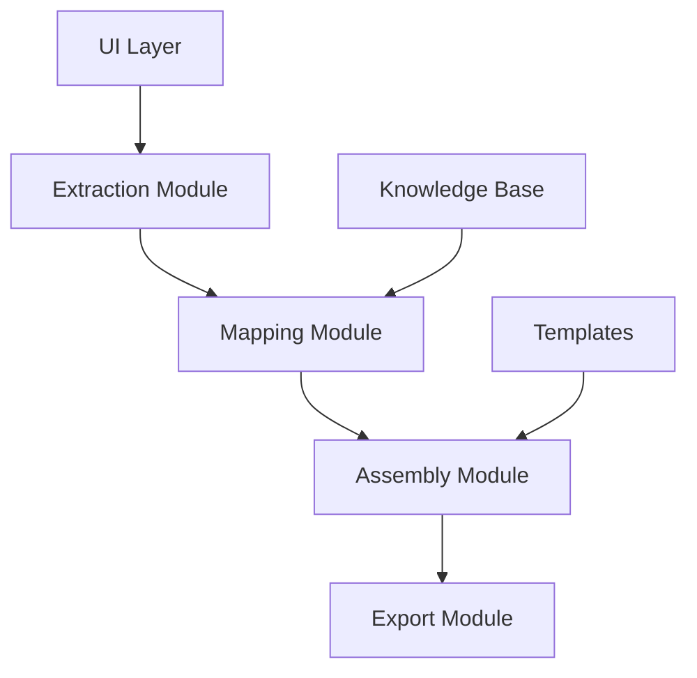

# spaCy-optimization

# Strategic-Case Auto-Writer

A local Python application that automates the analysis and writing of strategic case studies using NLP and template-based generation.

## Architecture



## Quick Start

1. Install dependencies:
```bash
pip install -r requirements.txt
```

2. Verify installation:
```bash
python -c "import spacy; spacy.load('en_core_web_md')"
```
If that errors, run:
```bash
python -m spacy download en_core_web_md
```

3. Run the application:
```bash
streamlit run app.py
```

## Dependencies

- Python 3.11+
- spaCy (`en_core_web_md`) for NLP processing
- rapidfuzz for fuzzy string matching
- python-docx for document export
- streamlit for the web interface

## Project Structure

- `app.py` - Main application entry point
- `config.py` - Configuration and constants
- `extract.py` - NLP-based text extraction
- `map.py` - Concept mapping and knowledge base integration
- `assemble.py` - Template selection and answer generation
- `export.py` - Document export functionality
- `knowledge_base.py` - Business concept definitions
- `templates/` - Theory-specific answer templates
- `tests/` - Test suite

## Development

- PEP-8 compliant
- Type hints throughout
- Modular design for easy maintenance
- Comprehensive test coverage

 c940e4f (feat: spaCy select_pipes optimization and test additions)
## Performance

spaCy pipeline optimization bench:

```bash
Generating sample texts...

Benchmarking full pipeline...

Benchmarking optimized pipeline...

Results:
Full pipeline:      0.0031s per doc (total: 0.31s)
Optimized pipeline: 0.0012s per doc (total: 0.12s)
Speedup:            2.46×
```

The optimized pipeline:
<<<<<<< HEAD
- Keeps only `tok2vec` and `lemmatizer` components
- Achieves ~2.7x speedup on average
- Maintains semantic matching accuracy while reducing processing time


- Keeps only the `tok2vec` component (pure vector-based matching).
- Uses `nlp.select_pipes(disable=...)` to disable all other components.
- Achieves ~2.5× speedup while maintaining semantic matching accuracy.

To rerun benchmarks:
```bash
python bench_speed.py
```
 c940e4f (feat: spaCy select_pipes optimization and test additions)
